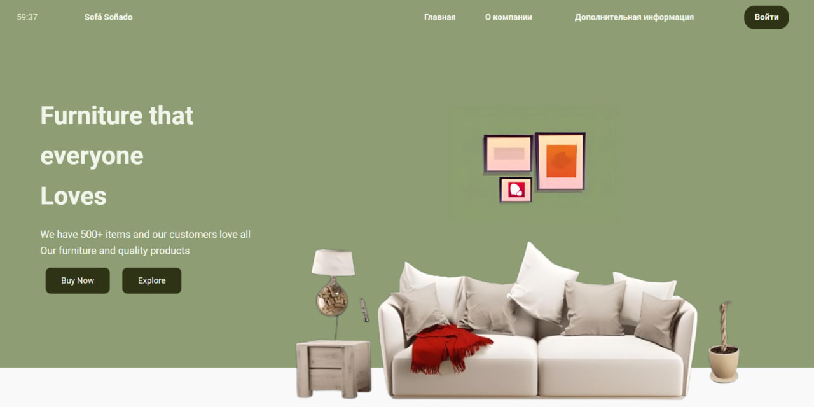
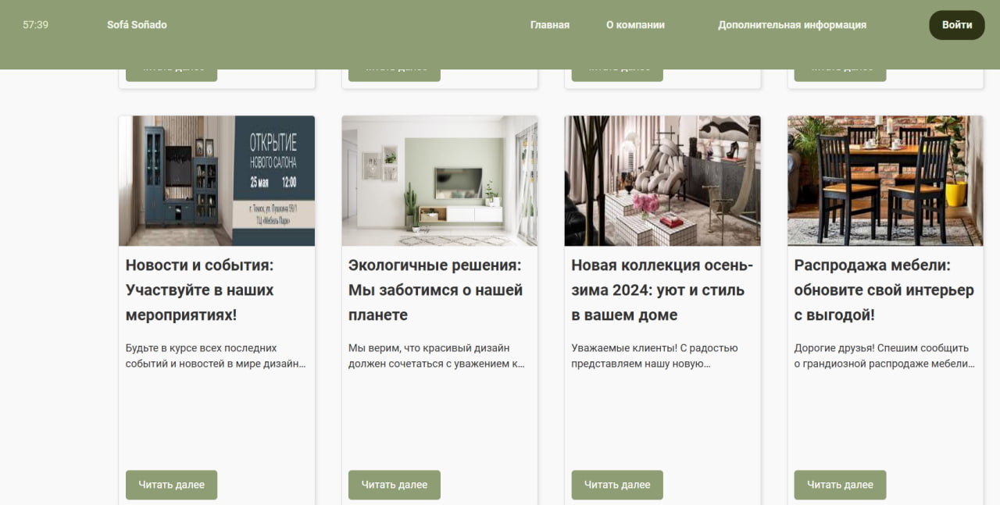
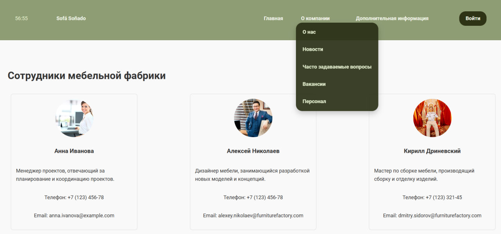
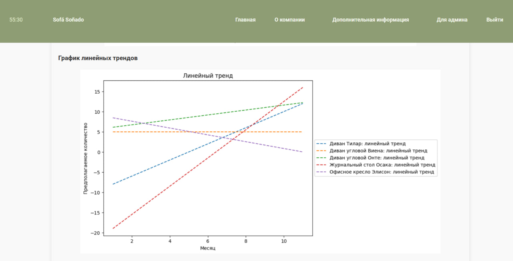
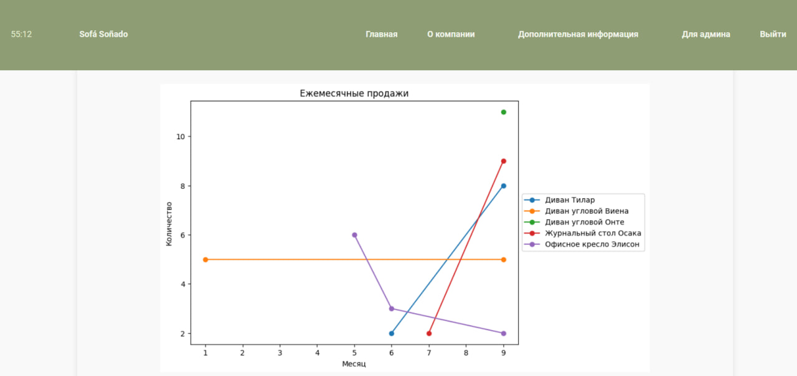

**Furniture Factory Project**
==========================

**Overview**
------------

This project is a web application for a furniture factory that produces various types of furniture for wholesale customers. The application allows users to view information about the factory, its products, and sales data.

**Features**
------------

### Home Page

* Displays a brief overview of the factory and its products.

### About Us

* Provides information about the factory, its history, and mission.

### News

* Displays a list of news articles with titles, brief descriptions, and images.

### Dictionary

* A list of frequently asked questions and answers about the factory and its products.

### Contacts

* Displays a list of factory employees with their photos, descriptions, and contact information.

### Privacy Policy

* A page with the factory's privacy policy.

### Vacancies

* A list of job vacancies at the factory.

### Reviews

* A list of customer reviews with ratings, text, and dates.

### Promo Codes and Coupons

* A list of active and archived promo codes and coupons.

**Models**
---------

The project uses the following models:

### Employee

* Represents a factory employee with fields for name, photo, description, and contact information.

### Product

* Represents a type of furniture with fields for name, code, type, model, price, and production status.

### Order

* Represents a customer order with fields for date, customer, product, and quantity.

### Customer

* Represents a wholesale customer with fields for name, code, phone, city, and address.

### News Article

* Represents a news article with fields for title, brief description, image, and date.

### Review

* Represents a customer review with fields for rating, text, and date.

### Promo Code

* Represents a promo code with fields for code, description.

**Relationships**
--------------

The models have the following relationships:

* **One-to-one**: Employee - User
* **One-to-many**: Product - Orders, Customer - Orders

**Admin Panel**
-------------

The project uses a custom-built admin panel to manage data. The admin panel provides features for creating, reading, updating, and deleting data, as well as filtering and editing related records.

**Authorization and Authentication**
-----------------------------------

The project uses Django's built-in authentication and authorization system to restrict access to certain features and data. There are four types of users: superuser, customer, employee, and anonymous user.

**API Integration**
------------------

The project uses two external APIs:

* [Quote of the day](https://favqs.com/api/qotd)
* [Gender by name](https://api.genderize.io)

**Statistics and Visualization**
-------------------------------

The project displays various statistics and visualizations, including:

* **Sales Data**: Displays sales data by product type, customer, and date.
* **Product Popularity**: Displays the most popular products by sales volume.
* **Customer Demographics**: Displays customer demographics by city and age.
* **Sales Forecast**: Displays a forecast of future sales based on historical data.

**Logging**
---------

The project uses Django's built-in logging system to log events and errors.

**Future Development**
---------------------

In the next semester, the project will be developed further to include:

* **Custom CSS styles**: The project will use custom CSS styles instead of Bootstrap.
* **Improved user interface**: The project will have a more user-friendly interface with improved navigation and search functionality.
* **More advanced statistics and visualization**: The project will display more advanced statistics and visualizations, including charts and graphs.

**Running the Project**
---------------------

To run the project, follow these steps:

1. **Clone the repository**: `git clone https://github.com/maratshchur/IGI_REPO.git`
2. **Create a virtual environment**: `python -m venv myenv` (optional)
3. **Activate the virtual environment**: `source myenv/bin/activate` (optional)
4. **Install dependencies**: `pip install -r requirements.txt`
5. **Migrate the database**: `python manage.py migrate`
6. **Run the development server**: `python manage.py runserver`
7. **Open the project in your web browser**: `http://localhost:8000`
